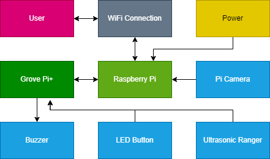

# IoT Project

Group 22's communication networks IoT coursework.

## Description

A smart doorbell that runs on the raspberry pi as a flask web server.

## Components Diagram

## Requirements

- Python 3.10.4
  - All modules in "requirements.txt"
  - `grovepi` requires `ScyPi`, which does not come built for the Pi. Therefore you should make sure you have the build tools required for `ScyPi` to ensure it doesn't error out. (This happened to me after letting it build for almost an hour, very annoying.)
- SQLite3

## Usage

Create a python environment with all the required modules.

Then run `create_db.py` to ensure the SQLite database exists.

Run `wsgi.py` to start the flask server. This is only suitable for testing and development. A proper WSGI server should be used for production.